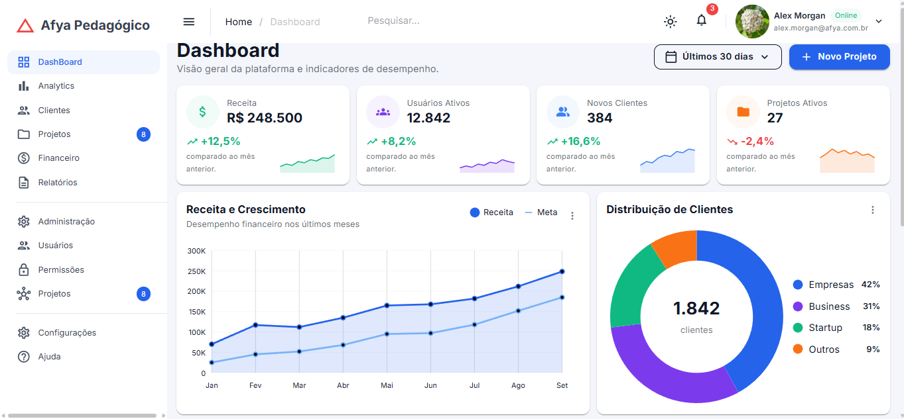
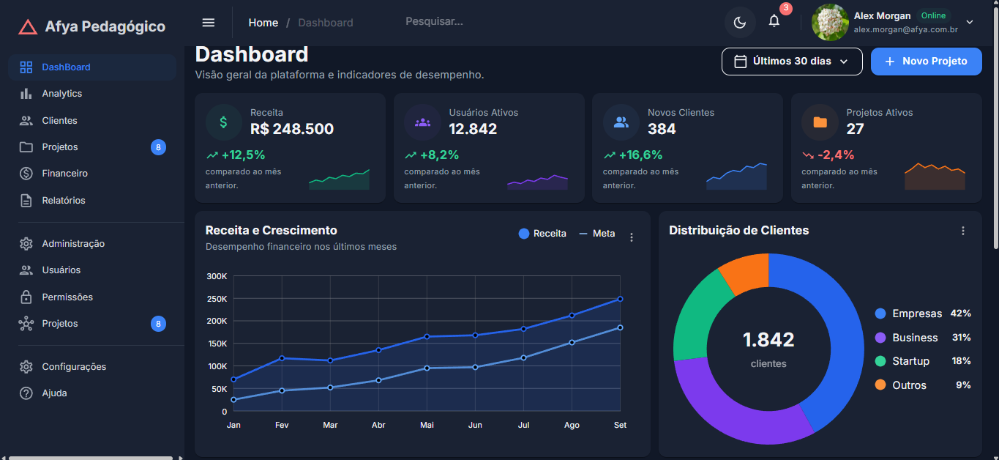
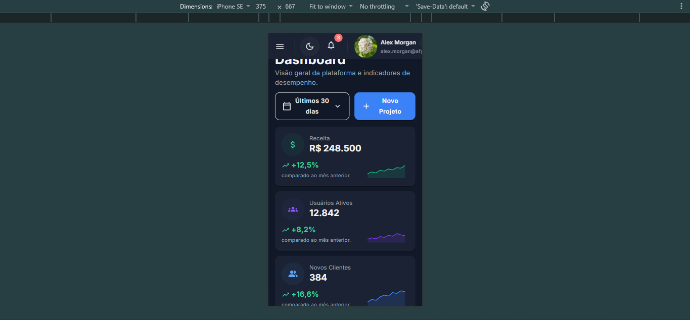
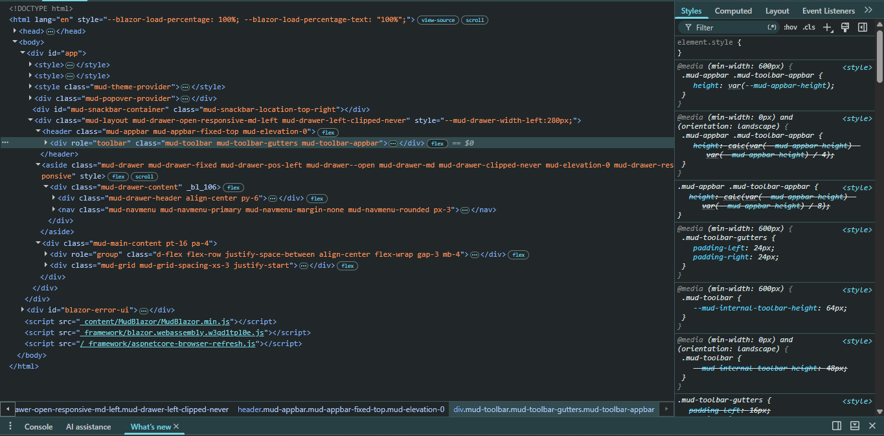

# Afya Admin — Dashboard com Blazor WebAssembly e MudBlazor

## Identificação

| | |
|---|---|
| **Aluno(a)** | Wenceslau Ruiz Juarez |
| **Matrícula** | ------ |
| **Faculdade** | Afya São Lucas Campus 2 |
| **Curso** | Ciencias da computação |
| **Disciplina** |Programação para Sistemas WEB |
| **Professor(a)** | Liluyoud Cury Lacerda|
| **Semestre** | 2026.2 |

## Objetivo do projeto

O **Afya Admin** é um painel de gestão contemporâneo e completamente responsivo, criado para centralizar a monitorização de indicadores de desempenho, receitas, estados de projetos e atividades recentes em uma organização acadêmica ou empresarial. A aplicação replica um ambiente corporativo autêntico, oferecendo uma interface clara, intuitiva e interativa para que gestores e administradores possam observar métricas relevantes em tempo real.

A tela inicial funciona como um *dashboard* executivo de alto nível. Nela, o usuário tem a possibilidade de alterar o período de análise, visualizar cartões com indicadores-chave de desempenho (KPIs) que incluem mini gráficos de tendência (*sparklines*), comparar mensalmente a receita obtida com a meta definida, conferir a distribuição percentual de clientes por segmento através de um gráfico de rosca e ainda acompanhar o progresso detalhado de projetos, além de um feed dinâmico de atividades mais recentes.

Toda a experiência foi desenvolvida com foco na usabilidade e na acessibilidade visual, oferecendo suporte nativo tanto para temas claro quanto escuro, além de uma adaptação fluida para dispositivos móveis, assegurando que o painel possa ser acessado sem dificuldades em smartphones, tablets e computadores de mesa.

## Tecnologias utilizadas

- .NET 10 / Blazor WebAssembly
- MudBlazor 9
- GitHub
- NotePad++

## Como executar

Passo a passo para outra pessoa clonar e rodar o projeto:

```bash
git clone https://github.com/WRuizAfya/afya-admin.git
cd afya-admin
dotnet watch
```

Necessita .Net 10.0

## Telas

### Tema claro


### Tema escuro


### Versão mobile


### HTML gerado (DevTools)


Explique em poucas linhas o que o print do DevTools mostra: qual componente você inspecionou, qual HTML ele gerou e quais classes apareceram.

## Estrutura do projeto

`
|-Components.
||-AtividadesRecentes.razor.
||-CabecalhoPagina.razor.
||-DashboardCard.Razor.
||-GraficoDistribuicaoClientes.razor.
||-GraficoReceita.razor.
||-KpiCard.razor.
||-PerformanceProjetos.razor.
||-ProjetosRecentes.razor.
||-SeletorPeriodo.razor.
||-Ui.cs.
|-Data.
||-DashboardData.cs.
|-Layout.
||-MainLayout.razor.
||-NavMenu.razor.
|-Pages.
||-Clientes.razor.
||-Dashboard.razor.
||-NotFound.razor.
|-Properties.
||-launchSettings.json.
|-docs/prints.
||-devtools.png.
||-mobile.png.
||-tema-claro.png.
||-tema-escuro.png.
|-wwwroot.
||-css.
||-data.
||-img.
||-icon-192.png.
||-index.html.
|.gitattributes.
|.gitignore.
|App.razor.
|Program.cs.
|README.md.
|_Imports.razor.
|afya-admin.csproj.
`
## Componentes criados

| Componente | Responsabilidade | Parâmetros que recebe |
|---|---|---|
| `CabecalhoPagina` | Exibe o título da página, subtítulo e uma área flexível para botões de ação. | • `Titulo` (`string`, obrigatório)<br>• `Subtitulo` (`string?`)<br>• `Acoes` (`RenderFragment?`) |
| `SeletorPeriodo` | Menu suspenso para seleção do intervalo de tempo (suporta `@bind-Valor`). | • `Opcoes` (`IReadOnlyList<string>`, obrigatório)<br>• `Valor` (`string`)<br>• `ValorChanged` (`EventCallback<string>`) |
| `DashboardCard` | Contêiner padronizado (card branco com sombra) que organiza título, subtítulo, ações, menu de opções e conteúdo. | • `Titulo` (`string`, obrigatório)<br>• `Subtitulo` (`string?`)<br>• `Acoes` (`RenderFragment?`)<br>• `Menu` (`RenderFragment?`)<br>• `ChildContent` (`RenderFragment?`) |
| `KpiCard` | Exibe indicador de desempenho com ícone pastel, valor, variação com tendência e mini gráfico de linha (*sparkline*). | • `Kpi` (`Kpi`, obrigatório) |
| `GraficoReceita` | Renderiza o gráfico comparativo **Receita x Meta** ao longo dos meses com legenda personalizada. | • `Meses` (`string[]`, obrigatório)<br>• `Receita` (`double[]`, obrigatório)<br>• `Meta` (`double[]`, obrigatório) |
| `GraficoDistribuicaoClientes` | Exibe gráfico de rosca (*donut chart*) por segmento de cliente com valor total centralizado e legenda customizada. | • `Total` (`int`, obrigatório)<br>• `Segmentos` (`IReadOnlyList<SegmentoCliente>`, obrigatório) |
| `PerformanceProjetos` | Exibe lista de projetos com barra de progresso linear, percentual e tarefas concluídas. | • `Projetos` (`IReadOnlyList<ProjetoPerformance>`, obrigatório) |
| `AtividadesRecentes` | Exibe feed de atividades contendo ícone de evento, avatares com iniciais, detalhes e horário. | • `Atividades` (`IReadOnlyList<Atividade>`, obrigatório) |
| `ProjetosRecentes` | Exibe tabela responsiva (`MudTable`) contendo status colorido (*chips*), progresso, prazo e menu de ações. | • `Projetos` (`IReadOnlyList<ProjetoRecente>`, obrigatório) |

## O que aprendi

Responda **com suas próprias palavras** (um parágrafo curto por pergunta):

1. Como uma aplicação Blazor WebAssembly inicia no navegador? Qual é o papel do `index.html`, da `<div id="app">` e do `Program.cs`?
	O navegador abre o index.html, que carrega o blazor.webassembly.js para baixar o .NET e executar o Program.cs, onde o Program.cs substitui o indicador de carregamento da `<div id="app">` pela aplicação Blazor.

2. Qual é a diferença entre um **Layout**, uma **Page** e um **Component** neste projeto? Dê um exemplo de cada.
	Layout é a moldura com menu/topo fixa no site (ex: MainLayout.razor), Page é uma tela ligada a uma URL (ex: Dashboard.razor) e Component é um bloco visual reutilizável de interface (ex: KpiCard.razor).

3. O que é um `RenderFragment` e como o `DashboardCard` usa esse recurso para ser reutilizado por vários cards?
	O RenderFragment é um parâmetro que aceita marcações HTML ou outros componentes, permitindo ao DashboardCard fornecer a estrutura base do card enquanto recebe conteúdos personalizados para cada utilização.

4. Como funciona o `@bind-Valor` no `SeletorPeriodo`? Qual é o papel do `ValorChanged`?
	O @bind-Valor sincroniza o valor selecionado bidirecionalmente entre o componente e a página pai, enquanto o ValorChanged é o evento disparado para avisar o pai que uma nova opção foi escolhida.

5. Por que os dados ficam na pasta `Data`, separados dos componentes? Que vantagem isso traz se, no futuro, os dados vierem de uma API?
	A pasta Data separa a lógica dos dados da interface visual, permitindo que uma futura integração com API altere apenas essa camada de dados sem precisar de modificar a estrutura dos componentes de tela.

6. Como o `MudGrid` com `xs`, `sm` e `lg` faz os cards de KPI se reorganizarem em telas de tamanhos diferentes?
	O MudGrid divide a interface em 12 colunas, fazendo com que o card ocupe 12 colunas no telemóvel (xs="12" — 1 por linha), 6 no tablet (sm="6" — 2 por linha) e 3 no PC (lg="3" — 4 por linha).

7. Como foi possível estilizar a página inteira sem escrever CSS? Explique o papel do tema (`MudTheme`) e das classes utilitárias.
	A estilização é gerida pelo MudTheme, que define cores, tipografia e bordas globais via C#, e pelas classes utilitárias do MudBlazor aplicadas no código HTML (como pa-4 e d-flex) para alinhamento e margens.

8. Por que o namespace do projeto é `afya_admin` e não `afya-admin`?
	O hífen é um operador de subtração no C# e não pode ser usado em identificadores, por isso o .NET converte automaticamente afya-admin para o namespace válido afya_admin.

## Dificuldades e soluções

Descreva pelo menos **dois problemas** que você enfrentou durante o desenvolvimento e como resolveu cada um.

1. Organização e Formatação de código devido ao programa que estava usando

Problema: No início, algumas ferramentas de edição utilizadas apresentavam desalinhamento de indentação e pequenas inconsistências na formatação das tags Razor e blocos @code, o que gerava alertas de compilação ou dificuldade de leitura visual.

Solução: Padronizei o ambiente utilizando extensões oficiais de formatação para C# e Razor, além de configurar atalhos automáticos de salvamento para aplicar o padrão de identação do SDK do .NET.

2. Ajuste de responsividade e quebra de elementos gráficos complexos no modo mobile

Problema: Alguns gráficos e tabelas maiores apresentavam sobreposição de texto ou estouravam as margens laterais quando visualizados em telas de smartphones muito estreitas.

Solução: Utilizei as propriedades nativas de responsividade do MudBlazor e classes utilitárias de visibilidade (como Hidden para ocultar colunas secundárias em dispositivos móveis) e envolvi os componentes em contêineres com rolagem horizontal controlada quando necessário.
